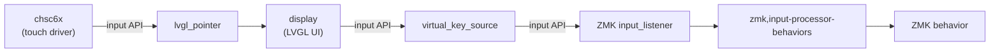

# zmk-module-xiaord

A ZMK module for the Seeed XIAO Round Display. Adds a touch-enabled circular display as a companion device for your keyboard.

## Hardware

- [Seeed Studio XIAO Round Display](https://wiki.seeedstudio.com/get_start_round_display/) (display + touchpad + RTC + microSD)
- Tested with XIAO BLE (nRF52840)

## Features

- Peripheral battery level shown on the display
- BLE connection status display and management
- ZMK behaviors triggered by touch input
- Current time display via RTC

### Home Screen

- **Clock** — current time from the RTC
- **Peripheral battery** — battery level of the split keyboard peripheral
- **Output status** — current output (USB / Bluetooth) and active BT profile

### Home Screen Shortcut Buttons

Up to 12 buttons can be placed around the edge of the screen, indexed clockwise from 12 o'clock (position 0). Default assignments:

| Position | Icon (`ICON_*`) | Action |
|----------|-----------------|--------|
| 0 (12 o'clock) | `ICON_UPLOAD` | Enter bootloader |
| 1 (1 o'clock) | `ICON_IMAGE` | PrintScreen |
| 2 (2 o'clock) | `ICON_VOLUME_MAX` | Volume up |
| 3 (3 o'clock) | `ICON_MUTE` | Mute |
| 4 (4 o'clock) | `ICON_VOLUME_MID` | Volume down |
| 5 (5 o'clock) | `ICON_NEXT` | Next track |
| 6 (6 o'clock) | `ICON_PLAY` | Play/Pause |
| 7 (7 o'clock) | `ICON_PREV` | Previous track |
| 8 (8 o'clock) | `ICON_WARNING` | Ctrl+Alt+Del |
| 9 (9 o'clock) | `ICON_USB` | Switch to USB output |
| 10 (10 o'clock) | `ICON_BLUETOOTH` | Go to BT management screen |
| 11 (11 o'clock) | `ICON_SETTINGS` | Go to clock settings screen |

### Bluetooth Management Screen

- Select a BT profile (up to 12 profiles)
- Clear a BT profile
- Switch to USB output mode

## Installation

Example config: [zmk-config-fish](https://github.com/TakeshiAkehi/zmk-config-fish.git)

### Adding to west.yml

Add this module to your keyboard config's `config/west.yml`:

```yaml
manifest:
  remotes:
    - name: zmkfirmware
      url-base: https://github.com/zmkfirmware
  projects:
    - name: zmk
      remote: zmkfirmware
      revision: main
      import: app/west.yml
    - name: zmk-module-xiaord
      url: https://github.com/TakeshiAkehi/zmk-module-xiaord.git
      revision: main
  self:
    path: config
```

### Adding to build.yaml

Add `xiaord` to the shield list of the dongle target. The dongle acts as the BLE central, so **no other split half should set `CONFIG_ZMK_SPLIT_ROLE_CENTRAL=y`**:

```yaml
include:
  - board: xiao_ble//zmk
    shield: xiaord your_keyboard_dongle
    artifact-name: your_keyboard_dongle
  # All other halves (left, right, …) run as peripherals — do NOT set CENTRAL=y.
  - board: xiao_ble//zmk
    shield: your_keyboard_left
    artifact-name: your_keyboard_left
  - board: xiao_ble//zmk
    shield: your_keyboard_right
    artifact-name: your_keyboard_right
```

> The `left`/`right` targets above are examples. The rule applies to every non-dongle half: because the dongle holds the central role, `CONFIG_ZMK_SPLIT_ROLE_CENTRAL=n` (the default) must be used for all keyboard halves when a dongle is present. Adding `CENTRAL=y` to any half would conflict with the dongle.

## Configuration

### Dongle Overlay

Your keyboard's dongle overlay (`your_keyboard_dongle.overlay`) must disable the physical key matrix and redirect ZMK to use the mock kscan provided by this module.

#### Minimal overlay (no home button customization)

```dts
#include "your_keyboard.dtsi"

// The dongle has no physical key matrix — disable it and use xiaord's mock kscan.
&kscan0 { status = "disabled"; };
/ { chosen { zmk,kscan = &xiaord_mock_kscan; }; };
```

| Element | Purpose |
|---------|---------|
| `#include "your_keyboard.dtsi"` | Shared hardware definitions (pinout, etc.) |
| `&kscan0 { status = "disabled"; }` | Disables the GPIO key matrix (the dongle has no switches) |
| `xiaord_mock_kscan` | Dummy kscan provided by xiaord; satisfies ZMK's requirement for a kscan device |

#### Overlay with home button customization

To reassign a home button icon and its behavior, add the following includes and override the relevant nodes:

```dts
#include "your_keyboard.dtsi"
#include <dt-bindings/xiaord/input_codes.h>
#include <dt-bindings/xiaord/icons.h>
#include <dt-bindings/zmk/keys.h>
#include <dt-bindings/zmk/outputs.h>

&kscan0 { status = "disabled"; };
/ { chosen { zmk,kscan = &xiaord_mock_kscan; }; };

// Change the icon at position 1 to show a keyboard symbol.
&home_button_1 { symbol = <ICON_KEYBOARD>; };

// Update virtual_symbol_behavior bindings.
// codes are fixed position indices (INPUT_VIRTUAL_POS_0..11) — they do NOT
// change when icons change. Only rewrite bindings when changing actions.
// You must rewrite the entire codes/bindings table — DTS does not support
// partial array overrides, so all entries must be listed.
&virtual_symbol_behavior {
    codes = <
        INPUT_VIRTUAL_POS_0    INPUT_VIRTUAL_POS_1
        INPUT_VIRTUAL_POS_2    INPUT_VIRTUAL_POS_3
        INPUT_VIRTUAL_POS_4    INPUT_VIRTUAL_POS_5
        INPUT_VIRTUAL_POS_6    INPUT_VIRTUAL_POS_7
        INPUT_VIRTUAL_POS_8    INPUT_VIRTUAL_POS_9
        INPUT_VIRTUAL_POS_10   INPUT_VIRTUAL_POS_11
        INPUT_VIRTUAL_SCROLL_CW   INPUT_VIRTUAL_SCROLL_CCW
    >;
    bindings = <
        &bootloader            &kp CAPSLOCK        /* pos 1 → CAPSLOCK */
        &kp C_VOL_UP           &kp C_MUTE
        &kp C_VOL_DN           &kp C_NEXT
        &kp C_PLAY             &kp C_PREV
        &kp LC(LA(DEL))        &out OUT_USB
        &out OUT_BLE           &none
        &msc MOVE_Y(-10)       &msc MOVE_Y(10)
    >;
};
```

> **Important:** `&virtual_symbol_behavior` stores `codes` and `bindings` as flat DTS arrays. Overriding the node replaces the arrays entirely — list all entries, not just the changed ones.
>
> **Key design point:** The fired code is always `INPUT_VIRTUAL_POS_<n>` (the button's slot index), independent of which icon is displayed. Changing a button's icon (`symbol`) does **not** require updating `codes` — only `bindings` needs to change if you also want a different action.

### Customizing Home Screen Buttons

All 12 home button nodes (`home_button_0` … `home_button_11`) are defined with labels, so you only need to reference the buttons you want to change:

```dts
#include <dt-bindings/xiaord/icons.h>

&home_button_1 { symbol = <ICON_KEYBOARD>; };  /* 1 o'clock */
```

See `include/dt-bindings/xiaord/icons.h` for available `ICON_*` codepoints (FontAwesome 5).
You can also specify a Unicode codepoint directly as an integer literal:

```dts
&home_button_1 { symbol = <0xF11C>; };  /* U+F11C = keyboard glyph */
```

Changing `symbol` only affects the displayed icon; the fired code remains `INPUT_VIRTUAL_POS_1`.

### Background Image

Three background images are available. Set one in your keyboard's `.conf` or `prj.conf`:

| Setting | Preview |
|---------|---------|
| `CONFIG_XIAORD_BG_1=y` (default) |  |
| `CONFIG_XIAORD_BG_2=y` |  |
| `CONFIG_XIAORD_BG_3=y` |  |

### RTC

Install a **CR927 coin cell** in the XIAO Round Display to retain the time across power cycles. Without a battery the clock resets on every boot.

## License

MIT. Free to use for any purpose. No warranty of any kind.

## Icon & Code Reference

Home button icons are specified using `ICON_*` constants defined in `include/dt-bindings/xiaord/icons.h`. Each constant is a FontAwesome 5 Unicode codepoint rendered via the bundled Montserrat LVGL font.

The virtual event codes fired on button tap are defined in `include/dt-bindings/xiaord/input_codes.h`:

| Range | Category |
|-------|----------|
| `0x00–0x0B` | Home button positions (`INPUT_VIRTUAL_POS_0` … `INPUT_VIRTUAL_POS_11`) |
| `0x0C–0x0D` | UI scroll actions (`INPUT_VIRTUAL_SCROLL_CW`, `INPUT_VIRTUAL_SCROLL_CCW`) |
| `0x40–0x6B` | ZMK BT/output behaviors (`INPUT_VIRTUAL_ZMK_*`) |

## Behavior Conversion Flow

When a home button is tapped, the following chain executes:

```
home button tap
  → INPUT_VIRTUAL_POS_<n> code emitted (n = clock-position index 0–11)
  → touchpad_listener (zmk,input-listener) receives the event
  → input-processors consulted in order:
      1. &virtual_zmk_behavior    — matches ZMK BT/output codes (0x40–0x6B)
      2. &virtual_symbol_behavior — matches position codes (0x00–0x0B)
  → matching binding (e.g. &kp CAPSLOCK) is executed
```

The fired code encodes only **position**, not icon. The displayed icon (`ICON_*` codepoint) is a pure display concern stored separately in the button descriptor and rendered via UTF-8 conversion.

### Processor roles

| Processor | Codes handled | Typical use |
|-----------|--------------|-------------|
| `virtual_zmk_behavior` | `INPUT_VIRTUAL_ZMK_*` (BT_SEL, BT_CLR, OUT_USB…) | Internal BT management pages |
| `virtual_symbol_behavior` | `INPUT_VIRTUAL_POS_*` (positions 0–11) + `INPUT_VIRTUAL_SCROLL_*` | Home screen buttons; customizable per keyboard |

Both processors are defined in `boards/shields/xiaord/zmk_behaviors.dtsi`. `virtual_zmk_behavior` covers all standard BT/output operations and rarely needs changes. `virtual_symbol_behavior` maps each position to a ZMK binding and is intended to be overridden per keyboard via the dongle overlay. Because codes are positional and fixed, overriding only requires updating `bindings` — `codes` stays the same regardless of which icons are displayed.

## Architecture



## Known Limitations / Not Yet Implemented

- Only tested on XIAO BLE (nRF52840)
- Occasional hang on the date-setting screen
- Loading custom background images from microSD
- Font color options other than white
- Battery management UI for the XIAO Round Display itself
